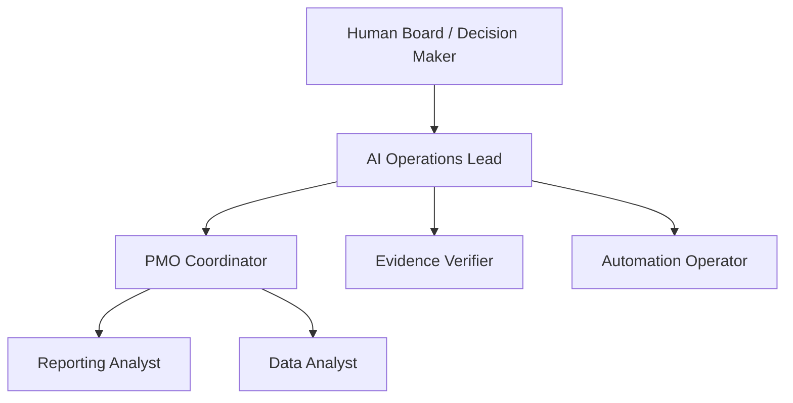

# RA Agent Operations Control Tower

A recruiter-facing case study showing how Operations / PMO principles can be applied to AI-agent teams without hiding the work behind a black box.

## Business problem

As organizations add automation and AI agents, managers still need the same operational controls they expect from human teams: ownership, budget visibility, workload, blocked work, service health, escalation rules, and auditable evidence.

## What I built

An original extension to **RA Operations Control Tower** that adds deterministic reporting for a synthetic AI workforce.

It tracks:

- agent role and reporting line;
- monthly budget and spend;
- open and blocked workload;
- heartbeat freshness;
- deterministic Green / Amber / Red health;
- executive KPIs and an auditable management report.

## Example operating model

## Demo KPIs

| KPI | Synthetic demo |
|---|---:|
| Total agents | 6 |
| Active / paused / offline | 4 / 1 / 1 |
| Budget utilization | 51.9% |
| Open tasks | 23 |
| Blocked tasks | 4 |
| RAG distribution | G 2 / A 3 / R 1 |

## Why it matters

This project demonstrates **Operations, PMO support, reporting, governance, data validation, Python and AI-workforce oversight** in one compact case study.

The health model is deterministic and testable. It does not call an LLM to decide whether an agent is healthy.

## Evidence

- Full repository: [ra-operations-control-tower](https://github.com/rash1ed/ra-operations-control-tower)
- Source module: [agent_ops.py](https://github.com/rash1ed/ra-operations-control-tower/blob/main/src/control_tower/agent_ops.py)
- Test suite: [test_agent_ops.py](https://github.com/rash1ed/ra-operations-control-tower/blob/main/tests/test_agent_ops.py)
- Demo report: [agent-operations-report.md](https://github.com/rash1ed/ra-operations-control-tower/blob/main/docs/agent-operations-report.md)
- Verified commit: [3130f844](https://github.com/rash1ed/ra-operations-control-tower/commit/3130f84496fb086e9ab1bd50129d1e332502bb50)

The full repository test suite passed **16 / 16 tests** before publishing this extension.

## Paperclip relation

This is **not a fork or copy of Paperclip** and contains no Paperclip code. Paperclip was used only as external inspiration for the broader concept of agent organizations, budgets and governance. A future adapter could consume exported or webhook-delivered health data from an external agent orchestrator.

## Public-data boundary

All figures, roles and agent records shown here are synthetic portfolio data. No employer, customer, credential or private operational data is included.