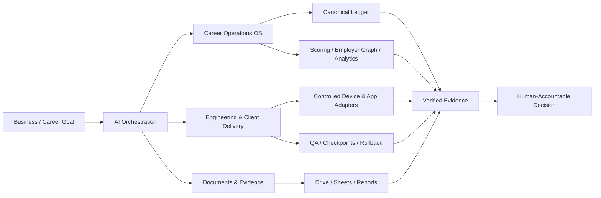

# Portfolio Architecture Map

```mermaid
flowchart LR
  Goal[Business / Career Goal] --> AI[AI Orchestration]
  AI --> Career[Career Operations OS]
  AI --> Design[Engineering & Client Delivery]
  AI --> Docs[Documents & Evidence]
  Career --> Ledger[Canonical Ledger]
  Career --> Intel[Scoring / Employer Graph / Analytics]
  Design --> Device[Controlled Device & App Adapters]
  Design --> QA[QA / Checkpoints / Rollback]
  Docs --> Drive[Drive / Sheets / Reports]
  Ledger --> Proof[Verified Evidence]
  Intel --> Proof
  Device --> Proof
  QA --> Proof
  Drive --> Proof
  Proof --> Decision[Human-Accountable Decision]
```

The architecture deliberately separates intent, execution, verification and evidence.
